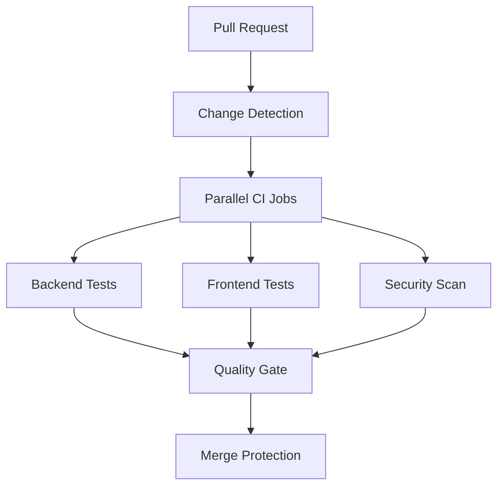

# CI/CD Pipeline Documentation
## Primer Seek Property Intelligence Platform

### Overview

This document outlines the comprehensive CI/CD pipeline for the Primer Seek property intelligence platform, designed for compliance-critical microschool data handling with zero-tolerance security requirements.

## Pipeline Architecture

### 🏗️ Monorepo Structure Support
- **Backend**: Python FastAPI with Poetry dependency management
- **Frontend**: React TypeScript with pnpm + Vite
- **Shared**: TypeScript types and utilities
- **Database**: Supabase PostgreSQL + PostGIS with migration support

### 🔄 Workflow Overview



## 🧪 CI Pipeline (`.github/workflows/ci.yml`)

### Workflow Triggers
- **Push**: `main`, `develop` branches
- **Pull Request**: All PRs to `main`, `develop`
- **Manual**: `workflow_dispatch` for ad-hoc runs

### Performance Optimization
- **Change Detection**: Only runs affected parts of the monorepo
- **Parallel Execution**: Backend and frontend jobs run simultaneously
- **Caching Strategy**: Aggressive caching for dependencies and build artifacts
- **Target Time**: < 10 minutes for standard PRs

### Backend Testing (`backend-tests`)

#### Test Matrix
- **Python Versions**: 3.12, 3.13
- **Service Dependencies**: PostgreSQL + PostGIS, Redis

#### Quality Checks (Mirror Pre-commit Hooks)
```yaml
- Black formatting (--check --diff)
- Ruff linting and formatting
- MyPy type checking (strict mode)
- Bandit security scanning
- Safety dependency vulnerability check
```

#### Test Execution
```yaml
- Unit Tests: 90% coverage threshold (compliance requirement)
- Integration Tests: Database + Redis integration
- Coverage Reports: XML, HTML, terminal output
- JUnit Reports: For CI integration
```

#### Artifacts Generated
- Test results (pytest XML)
- Coverage reports (HTML + XML)
- Security scan reports (JSON)
- Dependency vulnerability reports

### Frontend Testing (`frontend-tests`)

#### Test Matrix
- **Node.js Versions**: 18, 20
- **Package Manager**: pnpm (frozen lockfile)

#### Quality Checks
```yaml
- ESLint linting
- Prettier formatting check
- TypeScript compilation check
- Shared types validation
```

#### Build & Test
```yaml
- Vite production build
- Test execution (when configured)
- 85% coverage target
- Build artifact generation
```

### Security Integration
- **Trivy**: Filesystem vulnerability scanning
- **CodeQL**: Static analysis security testing
- **Snyk**: Dependency vulnerability scanning
- **Upload to Security Tab**: SARIF format results

## 🔒 Security Pipeline (`.github/workflows/security.yml`)

### Comprehensive Security Coverage

#### 1. Dependency Vulnerability Scanning
- **Python**: Safety + Poetry audit + Snyk
- **Node.js**: NPM audit + Snyk
- **Severity Threshold**: Medium and above
- **Output**: JSON reports + human-readable summaries

#### 2. Static Application Security Testing (SAST)
- **CodeQL**: Multi-language analysis (Python, JavaScript)
- **Bandit**: Python-specific security analysis
- **Semgrep**: Custom security rules and OWASP Top 10
- **Output**: SARIF format for GitHub Security tab

#### 3. Secret Detection
- **TruffleHog**: Comprehensive secret scanning
- **GitLeaks**: Git history secret detection
- **Custom Patterns**: Primer-specific secret detection
  - Supabase tokens (`sb-.*-auth-token`)
  - API keys patterns
  - Redis credentials in URLs

#### 4. Container Security
- **Trivy**: Docker image vulnerability scanning
- **Dockerfile Linting**: Best practices validation
- **Base Image Security**: Multi-layer security analysis

### Security Compliance Requirements

#### Zero-Tolerance Policy
```yaml
Critical Security Failures:
  - HIGH/CRITICAL vulnerabilities in dependencies
  - Detected secrets in code
  - SAST findings above threshold
  - Container security violations

Compliance Actions:
  - Automatic PR blocking
  - Security team notification
  - Mandatory review requirements
```

## 📦 Dependency Management (`.github/dependabot.yml`)

### Automated Updates Strategy

#### Update Schedule
- **Python Dependencies**: Weekly (Tuesday 9 AM)
- **Node.js Dependencies**: Weekly (Tuesday 10 AM)
- **GitHub Actions**: Weekly (Wednesday 9 AM)
- **Docker Images**: Weekly (Wednesday 10 AM)

#### Grouping Strategy
```yaml
Python Groups:
  - critical: FastAPI, Pydantic, SQLAlchemy (security + patch)
  - database: Redis, Supabase, PostgreSQL drivers
  - security: Auth libraries, security tools
  - dev-tools: Testing and linting tools

Frontend Groups:
  - react-core: React ecosystem
  - ui-styling: Tailwind, styling libraries
  - state-data: Zustand, TanStack Query
  - mapping: Mapbox, geospatial libraries
```

#### Security-First Approach
- **Auto-merge**: Security patches only
- **Review Required**: Major version updates
- **Ignore Policy**: Major updates for stable dependencies

## 🎯 Quality Gates & Branch Protection

### Branch Protection Rules

#### Main Branch Protection
```yaml
Required Status Checks:
  - CI Pipeline / Backend Tests (Python 3.12)
  - CI Pipeline / Frontend Tests (Node 18)
  - Security Scanning / Security Report Generation
  - Quality Gate evaluation

Required Reviews:
  - 1 review from CODEOWNERS
  - Dismiss stale reviews: true
  - Require review from code owners: true

Additional Rules:
  - Require up-to-date branches
  - Require signed commits
  - Include administrators: true
  - Allow force pushes: false
  - Allow deletions: false
```

#### Develop Branch Protection
```yaml
Required Status Checks:
  - CI Pipeline / Quality Gate
  - Security Scanning (if changed files)

Required Reviews:
  - 1 review required
  - Allow self-review for maintainers

Additional Rules:
  - Require up-to-date branches
  - Allow force pushes: false
```

### Quality Thresholds

#### Coverage Requirements
```yaml
Backend (Compliance-Critical):
  - Unit Tests: 90% minimum
  - Integration Tests: Required for DB/API changes
  - Security Scan: Zero HIGH/CRITICAL findings

Frontend (User-Facing):
  - Test Coverage: 85% target
  - Build Success: Required
  - Linting: Zero errors/warnings
  - Type Check: Must pass
```

#### Performance Targets
```yaml
CI Pipeline Performance:
  - Total Runtime: < 10 minutes
  - Backend Tests: < 5 minutes
  - Frontend Tests: < 3 minutes
  - Security Scan: < 7 minutes (weekly full scan)
```

## 🔧 Workflow Configuration

### Environment Variables
```yaml
Global Configuration:
  - PYTHON_VERSION: "3.12"
  - NODE_VERSION: "18"
  - POETRY_VERSION: "1.8.0"
  - PNPM_VERSION: "8.15.6"
  - BACKEND_COVERAGE_THRESHOLD: 90
  - FRONTEND_COVERAGE_THRESHOLD: 85
```

### Cache Configuration
```yaml
Cache Keys:
  - Poetry: poetry-${{ hashFiles('backend/poetry.lock') }}
  - PNPM: pnpm-${{ hashFiles('frontend/pnpm-lock.yaml') }}
  - Python Setup: python-${{ runner.os }}-${{ matrix.python-version }}
  - Node Setup: node-${{ runner.os }}-${{ matrix.node-version }}
```

### Service Dependencies
```yaml
PostgreSQL:
  - Image: postgis/postgis:16-3.4
  - Database: test_primer_seek
  - Extensions: PostGIS for geospatial testing

Redis:
  - Image: redis:7-alpine
  - Port: 6379
  - Health Checks: Enabled
```

## 📊 Reporting & Notifications

### Artifact Management
```yaml
Artifact Retention:
  - Test Results: 30 days
  - Coverage Reports: 30 days
  - Security Reports: 90 days
  - Build Artifacts: 7 days

Cleanup Schedule:
  - Weekly automated cleanup
  - Remove artifacts > 30 days
  - Remove caches > 7 days
  - Remove workflow runs > 90 days
```

### PR Integration
```yaml
Automated Comments:
  - CI Pipeline status
  - Test coverage summary
  - Security scan results
  - Quality gate evaluation

Status Checks:
  - Detailed workflow status
  - Individual job results
  - Coverage threshold compliance
  - Security compliance status
```

## 🚀 Deployment Readiness

### Production Deployment Prerequisites
```yaml
Required Checks:
  ✅ All CI checks pass
  ✅ Security compliance verified
  ✅ Code review approval
  ✅ Branch up-to-date with main
  ✅ No HIGH/CRITICAL vulnerabilities
  ✅ Coverage thresholds met

Additional Requirements:
  - Signed commits (GPG verification)
  - CODEOWNERS approval
  - Security team sign-off (for security changes)
  - Database migration validation (if applicable)
```

## 🔍 Monitoring & Maintenance

### Regular Maintenance Tasks
```yaml
Weekly:
  - Review Dependabot PRs
  - Security scan result review
  - Performance metrics analysis

Monthly:
  - Update CI/CD documentation
  - Review quality thresholds
  - Analyze pipeline performance
  - Update security patterns

Quarterly:
  - Full security audit
  - Dependency version strategy review
  - CI/CD pipeline optimization
  - Compliance requirement updates
```

### Troubleshooting Guide

#### Common Issues
1. **Cache Misses**: Check cache key generation
2. **Test Timeouts**: Review service health checks
3. **Security Failures**: Check for false positives in `.secrets.baseline`
4. **Coverage Drops**: Investigate test file inclusion patterns

#### Performance Optimization
1. **Parallel Jobs**: Maximize concurrent execution
2. **Change Detection**: Minimize unnecessary work
3. **Cache Strategy**: Optimize cache hit rates
4. **Artifact Management**: Regular cleanup automation

## 📞 Support & Escalation

### Contact Information
- **CI/CD Issues**: DevOps Team
- **Security Concerns**: Security Team
- **Code Quality**: Senior Developers
- **Emergency**: On-call Engineer

### Escalation Path
1. **Level 1**: Automated failure notifications
2. **Level 2**: Team Slack notifications
3. **Level 3**: Email alerts for critical failures
4. **Level 4**: Emergency contacts for security incidents
